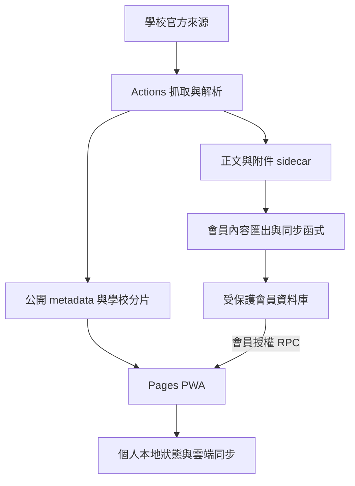

# 現行架構導覽

查核基線：`5c697048e3742ff63dde88b6a6e5b066a26b8db0`（2026-10-09）。
這是原始碼導覽，不是部署／資料庫套用證明。正式站 `index.html`、`app.js`、`sw.js` 已與此基線逐位元組核對一致；會員、通知與 DB 的線上端到端行為本輪未執行。

## 資料流

## 執行入口與關係

| 區域 | 入口／資料 | 消費者與責任 |
|---|---|---|
| 公告取得 | `scrape-schedule.yml` 呼叫 `scrape-hourly.yml` → `scraper/scrape.py`，來源見 `scraper/config.json` | 官方列表解析、school + article 識別、去重、歷史保留、tombstone，輸出公開資料及抓取狀態 |
| 正文與附件 | `detail_backfill.py` → `detail_parser.py`、`attachment_parser.py`、`local_ocr.py`、`extractive_summary.py` | 有限額補齊 sidecar；無正文／不可讀附件不等於正文為空；完整來源不直接當公開網站內容 |
| 公開分片 | `public_shards.py` → `docs/data/schools/{school}/current.json`、`archive.json`、`manifest.json` | `docs/app.js` 依學校選擇分片；all／fallback 使用 `announcements.json`、`archive.json`，archive 延後讀取 |
| 會員正文 | `tools/export-member-content.js` → `announcement-content-sync` | 已設定的 Actions 路徑向受保護資料庫同步；瀏覽器經 `member_announcement_index`／`member_announcement_detail` 讀取；不要把 sidecar 當匿名全文 API |
| 行事曆 | `schoolcal.py` + `calendar_adapter.py` + `calendar_schema.py`；官方來源＋`scraper/events.json` | 產出 calendar JSON、source status、ICS；保留可信資料與解析品質閘門；`app.js` 消費日曆 JSON |
| 課表 | `timetable.py` + `timetable_adapter.py` | 公開 `class-timetables.json`，前端依 profile 校別／班級顯示 |
| 瀏覽器外殼 | `docs/index.html` → 有順序的 JS 模組；`account-config.js` 動態載入 `capability-layer.js` | 會員授權要早於 app；`docs/sw.js` 管理快取／通知點擊，外殼版本須與 HTML 引用對齊 |
| 搜尋與問校務 | `search-query.js`、`search-taxonomy.js`、`announcement-validity*.js`、`assistant-qa.js` | 現有問答是規則／來源整理，未接生成模型；搜尋、有效性及來源比較都有各自測試 |
| 我的今天 | `relevance.js`、`today.js`、`profile.js`、`assistant-feedback.js` | 由個人設定、公告、日曆與待辦投影；與 query policy 分離；未整合新 `announcement_intel` |
| 個人狀態 | `task-state.js`、`calendar-state.js`、`account-sync.js` → `supabase-sync.js` | 帳號命名空間、mutation queue／同步；資料表包括 subscriptions、reads、preferences、tasks、calendar events；刪除與同步保留既有安全語意 |
| 會員與管理 | `account-auth.js`、`capability-layer.js`、`announcement-cleanup.js` | username-auth／Google UI、審核／角色／capabilities、公告人工清理與 archive／restore RPC；目前 Production config 的 Google UI 仍為 true |
| 管理員 CSV | `docs/announcement-csv.js`、`admin-announcement-export-source.js`、`admin-announcement-csv-ui.js` | Pages owner-only 完整匯出：公開 catalog + 已授權正文讀取；serializer 與 Preview 共用，正式前端無需 Vercel API |
| 通知 | `push-subscription.js`、`reminder-rules.js`、`notify.py`、reminder functions／scheduler SQL | 瀏覽器訂閱、可信提醒目標、ntfy 與 push delivery 各有不同執行路徑；SQL 存在不表示 cron 已啟用 |
| 後端契約 | `supabase/migrations/`、functions、scheduler、tests | migrations 必須保留順序與歷史；RPC 授權、所有權／RLS 邊界不是前端 UI 判斷的替代品 |

## 部署與環境

- 正式站：GitHub Pages 的 `docs/`；本輪讀取的三個公開執行入口與最新 main 一致。Pages 後台設定 API 無法讀取，所以不推定完整設定。
- Vercel：`vercel.json` 建置 `tools/build-staging.js`，輸出 `dist-staging`。它複製 docs，覆寫測試 Auth config、公開資料投影、PKSH metadata overlay、272 筆行事曆候選與測試外殼，再加入隔離模擬登入。不是正式站的單純鏡像。
- `api/admin-announcement-export.js` 與 `api/mock-admin.js` 僅提供預覽端能力。模擬登入的分支／部署／expiry 限制不能刪除。
- Vercel staging 近 100 筆記錄顯示會從 main 及 feature branch 自動部署；專案名稱不能證明環境隔離或分支依賴。本輪只停用 `codex/project-cleanup-20261009` 自動部署，其餘分支設定不變。
- 抓取排程由現行 workflows 定義。本輪保留所有 workflow 位元組，沒有重跑 Actions、通知、爬取或部署。
- 會員 DB 是否套用 migrations、Auth provider 是否停用、RLS 是否通過，必須讀對應環境證據；本輪未呼叫 Supabase。

## 測試與證據的界線

- 多數 `tests/test_*.js` 是離線模組／契約測試；staging build test 寫入獨立暫存目錄。
- `test_rls_behavioral.js`、`test_rls_deployed.js` 會建立線上 DB fixture，禁止直接 wildcard 執行全部測試。
- Python tests 使用 synthetic fixture／暫存輸出。OCR tests 另需 Tesseract chi_tra + eng 與中文字型。
- `tools/evaluate-assistant-qa.js` 載入 2026-08-30 的固定 QA 實作及資料快照，通過只證明該基準；不能證明現行問答端到端正確。
- `tools/check-legal-compliance.js` 依特定來源／政策／驗收文件執行；這些文件具有機器引用，不能因年代舊就刪除。
- `notification-state.js` 雖非 HTML 的直接 script，仍由 Service Worker 引入；不能只掃 HTML 判定死碼。

## 未合併工作線

- `announcement_intel`：原工作 HEAD `5778da07df9069b449bb15540e1541512e8d8ac1`；後續 repair HEAD `096927a597f7e1b8b1a1e179a1feaa3f64d8a6e9` 只有 ledger 增補，intel 檔案一致。已有私人可還原備份，未接正式前端、未跑人工標註、未宣稱模型準確率。
- acquisition、ranking v3／worklog、review host 與 UI／calendar 等分支有獨立成果，見 `maintenance/cleanup-20261009/branches.json`。ahead、patch equivalent 都不能單獨決定刪除。
- 舊專用技術文件僅供理解來源／契約與歷史，不能作為開發指令或目前已部署功能證明。新的任務從實際 code、refs 與本輪授權核對。
